# 【PHP】 サーバからファイルをアップロードしよう！<br>[REST API]
*2016/12/06作成*

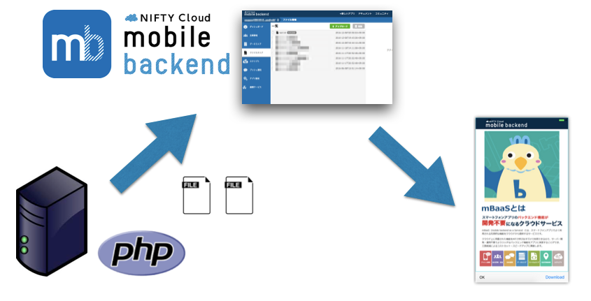

## 概要
* [ニフティクラウドmobile backend](http://mb.cloud.nifty.com/)の『ファイルストア』機能を、REST APIを使用してファイル（画像、テキストなど）をサーバから登録（サーバーから[ニフティクラウドmobile backend](http://mb.cloud.nifty.com/)へ登録）するサンプルプロジェクトです。
* ニフティクラウドmobile backendが提供している[REST API](http://mb.cloud.nifty.com/doc/current/rest/common/format.html)を利用することで、サーバ環境からも簡単にファイルをアップロードの実装が可能です
* 簡単な操作ですぐに [ニフティクラウドmobile backend](http://mb.cloud.nifty.com/)の機能を体験いただけます★☆

## ニフティクラウドmobile backendって何？
* スマートフォンアプリのバックエンド機能（プッシュ通知・データストア・会員管理・ファイルストア・SNS連携・位置情報検索・スクリプト）が**開発不要**、しかも基本**無料**(注1)で使えるクラウドサービスです
* 今回は「ファイルストア」機能を使用し、[ニフティクラウドmobile backend](http://mb.cloud.nifty.com/)を「__CMS__」として使用してみましょう！

注1：詳しくは[こちら](http://mb.cloud.nifty.com/price.htm)をご覧ください

 

## 環境の準備
### 動作環境
下記ローカル環境で動作確認しております
##### Mac
* macOS Sierra version 10.12.1
* Server version: Apache/2.4.23 (Unix)
* PHP v5.4以降
 * httpsへ通信が必要のため、https通信ができるよう環境をご用意ください。
 * v5.6.x の場合、SSL証明書が検証されますので、正しい証明書をご利用ください。(参考：http://php.net/manual/ja/migration56.openssl.php)

##### Windows
```
調整中
```

### PHP環境準備について
PHP環境及びPHP対応するサーバー(Apacheなど)を用意する必要がありますので、以下のいずれかを参考していただき、動作環境をご用意ください。
#### ローカル環境
##### Macの場合
既にPHP及びApacheが入っております。Apacheを起動したら、そのまま、ブラウザーで確認いただけます。参考のために、macOS Sierra version 10.12.1の場合、以下の設定を行いました。
1. Apacheを起動する
```bash
$ sudo apachectl start
```

1. 確認するには、ブラウザーから以下のURLをアクセスします
```text
http://localhost/
```
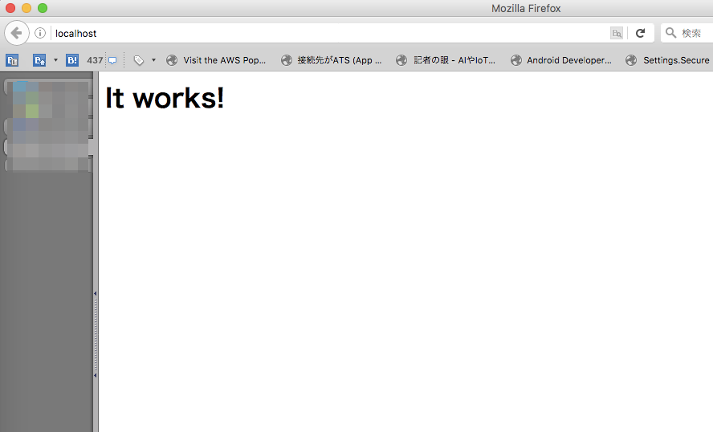

1. PHP設定を有効します
Apacheの設定ファイルの`httpd.conf`を編集します、以下の設定を有効にします。（`#`を削除します。）
```text
#LoadModule php5_module libexec/apache2/libphp5.so
```

 > 参考：Macの場合
 > * 設定ファイルは `/etc/apache2/httpd.conf`にあります。
 > * 設定ファイルの編集はコマンドの利用が便利です
 > * 下記コマンドでviを使用した編集が可能です
 ```bash
 $ sudo vi /etc/apache2/httpd.conf
 ```
[参考：viコマンド(外部サイト)](http://net-newbie.com/linux/commands/vi.html)

1. Apacheを再起動する
```bash
$ sudo apachectl restart
```

##### Windowsの場合
```
調整中
[こちら](http://php.net/manual/ja/install.windows.php)を参考していただき、インストールを行ってください。
```

#### サーバ環境
デフォルトでPHPが入っていない場合、[こちら](http://php.net/manual/ja/install.php)を参考にしていただき、インストールを行ってください。

## 作業の手順
### 1. GitHubからサンプルをダウンロード
* 下記リンクをクリックしてプロジェクトをダウンロードします

__[PHP_CMS_Demo](https://github.com/NIFTYCloud-mbaas/PHP_CMS_Demo/archive/master.zip)__

* ダウンロードしたファイルを解凍し、下記３つのファイルが入っていることを確認してください
 * `index.php`：ファイルをアップロードするフォーム処理
 * `action.php`：ファイルをアップロードする処理
 * `index.png`：フォームの画像
* 上記の３つのファイルをApacheのホームディレクトリにコピーします

※ホームディレクトリはApacheの設定ファイルに設定してあります。

#### 参考：Macの場合
デフォルト設定の場合、Apacheのホームディレクトリは以下にあります。
```text
DocumentRoot "/Library/WebServer/Documents"
```

### 2. [ニフティクラウドmobile backend](http://mb.cloud.nifty.com/)の会員登録/ログインとアプリ作成
* 上記リンクから会員登録（無料）をします。登録ができたらログインをすると下図のように「アプリの新規作成」画面が出るのでアプリを作成します

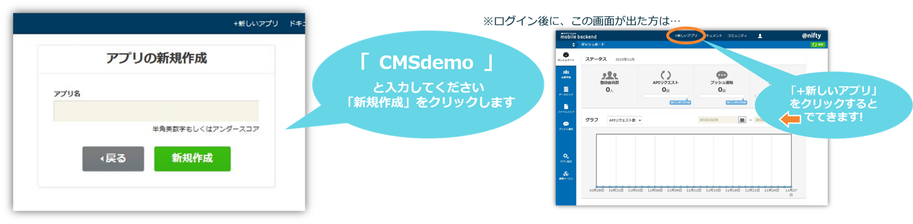

* アプリ作成されると下図のような画面になります
* この２種類のAPIキー（アプリケーションキーとクライアントキー）はPHPのプログラムと[ニフティクラウドmobile backend](http://mb.cloud.nifty.com/)を紐付けるために、後ほど使用します

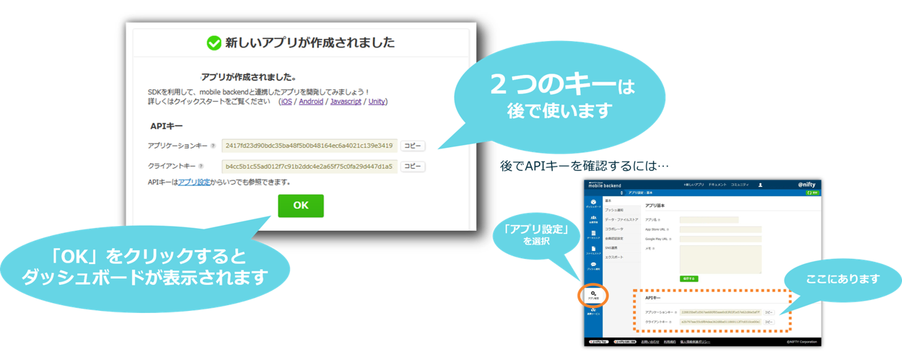

### 3. APIキーの設定
* `action.php` ファイルを編集します
 * 編集方法は[こちら](/PHP_CMS_Demo#参考：Macの場合)
* 5～7行目「`//APIキーの設定`」の部分に、[ニフティクラウドmobile backend](http://mb.cloud.nifty.com/)のダッシュボード上で確認したAPIキーを貼り付けます

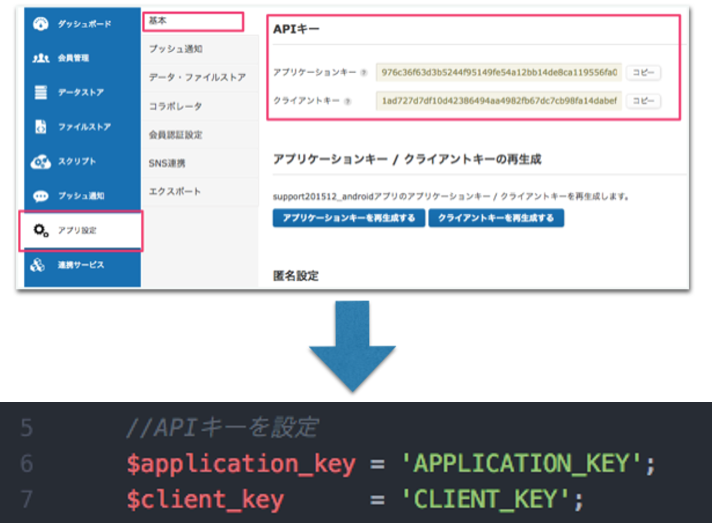

* それぞれ`APPLICATION_KEY`と`CLIENT_KEY`の部分を書き換えます
 * このとき、シングルクォーテーション（`'`）を消さないように注意してください！
* 書き換え終わったら保存を忘れずに！


### 4. 動作確認
* ブラウザーから以下のURLをアクセスします
```text
http://localhost/index.php
```

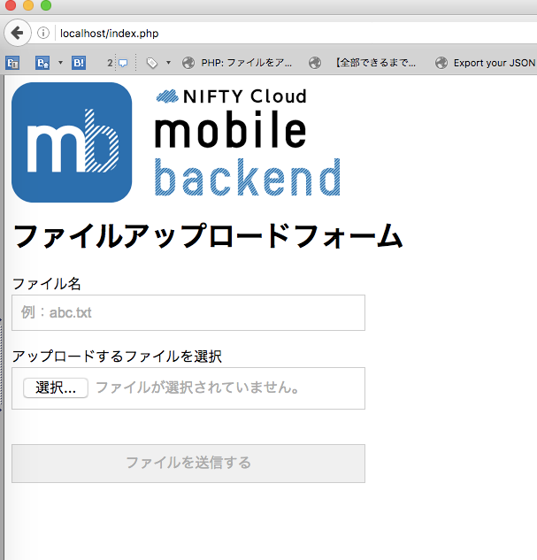

* 「ファイル名」を入力し、アップロードするファイルを選択します

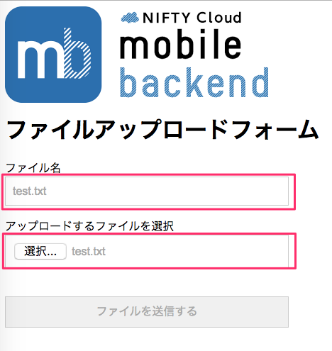

> ※参考：ここでアップロードするファイルの指定はありませんが、先ほどダウンロードしたフォルダーにサンプルとして利用可能なファイル（`test.txt`）を用意しています。ご活用ください。

>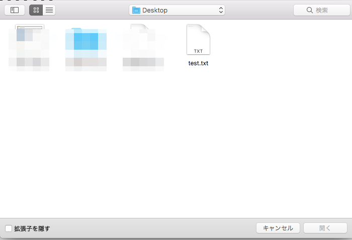


* 「ファイルを送信する」ボタンをクリックします
* 正常にアップロードできる場合、「実行結果」として、作成したファイル名と作成日時が表示されます

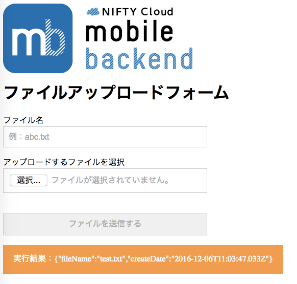

* [ニフティクラウドmobile backendの管理画面](https://console.mb.cloud.nifty.com/)を確認しましょう
* ファイルがアップロードされたことを確認できます

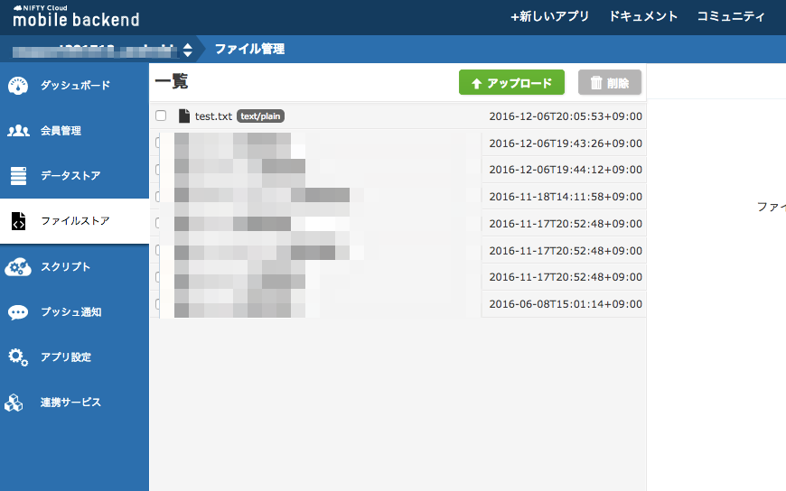

* エラーの場合は以下のように表示されます
 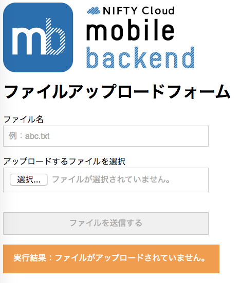
 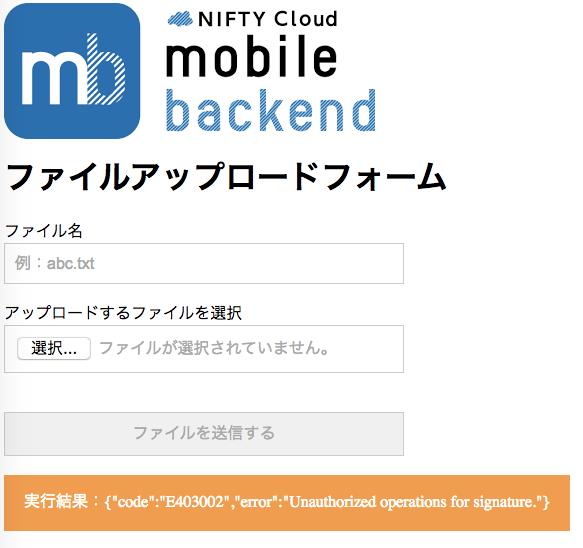
 * エラーコードが表示されている場合は[こちら](http://mb.cloud.nifty.com/doc/current/rest/common/error.html#REST%20API%E3%81%AE%E3%82%A8%E3%83%A9%E3%83%BC%E3%82%B3%E3%83%BC%E3%83%89%E3%81%AB%E3%81%A4%E3%81%84%E3%81%A6)から確認いただけます。

## 解説
### REST API実装について
* ニフティクラウド mobile backend は REST API を提供しているため、外部サーバからすべての機能をご利用いただけます
* REST APIの利用は、共通フォーマットを従ってリクエストを作成する必要があります
 * 共通フォーマットについては[こちら](http://mb.cloud.nifty.com/doc/current/rest/common/format.html)をご確認ください。
* 共通フォーマットではセキュリティを守るため、独自仕様として毎回シグネチャーを作成付しリクエストヘッダーに付加する必要があります
 * シグネチャーの作成については[こちら](http://mb.cloud.nifty.com/doc/current/rest/common/signature.html)をご参照ください。

#### コード紹介
* シグネチャーの実装は以下のようになっています。
```php
//シグネチャー計算
$header_string = "SignatureMethod=HmacSHA256&";
$header_string .= "SignatureVersion=2&";
$header_string .= "X-NCMB-Application-Key=".$application_key . "&";
$header_string .= "X-NCMB-Timestamp=".$timestamp;
$signature_string = $method . "\n";
$signature_string .= $fqdn . "\n";
$signature_string .= "/" . $api_version . "/" . $path . "\n";
$signature_string .= $header_string;
$signature = base64_encode(hash_hmac("sha256", $signature_string, $client_key, true));
```

* ヘッダー情報の実装は以下のようになっています
```php
//ヘッダー指定
$headers = array(
'Content-Type: application/json',
'X-NCMB-Application-Key: '.$application_key,
'X-NCMB-Signature: '.$signature,
'X-NCMB-Timestamp: '.$timestamp
);
```

### REST APIでのファイルの登録について
* ファイルを登録するためのREST APIを利用することで、サーバからファイル登録が可能です
 * ファイル登録REST APIについて詳しくは[こちら](http://mb.cloud.nifty.com/doc/current/rest/filestore/fileRegistration.html)をご参照ください。

* `index.php`にはファイルをアップロードするフォームが書かれています
```html
<!-- データのエンコード方式である enctype は、必ず以下のようにしなければなりません -->
<form enctype="multipart/form-data" action="action.php" method="POST">
<!-- input 要素の name 属性の値が、$_FILES 配列のキーになります -->
ファイル名
<br>
<input type="text" name="filename" value="例：abc.txt">
<br>
アップロードするファイルを選択
<div id= "file_upload">
<input type="file" id="userfile" name="userfile" style=";">
</div>
<br>
<input type="submit" value="ファイルを送信する" />
</form>
```

* `action.php`フォームから取得する処理
```php
$filename = htmlspecialchars($_POST['filename']);
$filepath = $_FILES['userfile']['tmp_name'];
$contentType = $_FILES['userfile']['type'];
```

* ファイル登録REST APIで、フォームから選択したファイル（`file`）を指定する必要があります。リクエストの`$content`作成処理は以下のようになっています。
```php
//一時ファイルができている場合、ファイルコンテンツを作成
$file_contents = file_get_contents($filepath);
$content = "--".MULTIPART_BOUNDARY."\r\n".
"Content-Disposition: form-data; name=\"file\"; filename=\"".basename($filepath)."\"\r\n".
"Content-Type: ".$contentType."\r\n\r\n".
$file_contents."\r\n";
$content .= "--".MULTIPART_BOUNDARY."--\r\n";
```

* リクエスト作成処理は下記のようになっています
```php
//ヘッダー指定
$headers = array(
  'Content-Type: multipart/form-data; boundary='.MULTIPART_BOUNDARY,
  'X-NCMB-Application-Key: '.$application_key,
  'X-NCMB-Signature: '.$signature,
  'X-NCMB-Timestamp: '.$timestamp
);
$options = array('http' => array(
  'method' => 'POST',
  'content' => $content,
  'header' => implode("\r\n", $headers),
  'ignore_errors' => true
));
$file_upload_request = file_get_contents($url, false, stream_context_create($options));
```

 ## 参考
 * [ニフティクラウドmobile backend：REST API](http://mb.cloud.nifty.com/doc/current/rest/common/format.html)
 * [ニフティクラウドmobile backend：ファイル登録](http://mb.cloud.nifty.com/doc/current/rest/filestore/fileRegistration.html)
