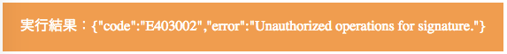

# 【PHP】 サーバからファイルをアップロードしよう！<br>[REST API]

*2016/12/06作成*


## 概要

 * [ニフティクラウドmobile backend](http://mb.cloud.nifty.com/)の『ファイルストア』機能のデモであり、ファイル（画像、テキストなど）をサーバから登録するためのサンプルです。
 * ニフティクラウドmobile backendが提供している[REST API](http://mb.cloud.nifty.com/doc/current/rest/common/format.html)を利用することで、サーバ環境からも簡単にファイルをアップロードの実装が可能です
 * 簡単な操作ですぐに [ニフティクラウドmobile backend](http://mb.cloud.nifty.com/)の機能を体験いただけます★☆

## ニフティクラウドmobile backendって何？
 スマートフォンアプリのバックエンド機能（プッシュ通知・データストア・会員管理・ファイルストア・SNS連携・位置情報検索・スクリプト）が**開発不要**、しかも基本**無料**(注1)で使えるクラウドサービス！

 注1：詳しくは[こちら](http://mb.cloud.nifty.com/price.htm)をご覧ください

 

## 環境の準備

下記環境で動作確認しております

* macOS Sierra version 10.12.1
* Server version: Apache/2.4.23 (Unix)
* PHP v5.4以降
 * httpsへ通信が必要のため、https通信ができるよう環境をご用意ください。
 * v5.6.x の場合、SSL証明書が検証されますので、正しい証明書をご利用ください。(参考：http://php.net/manual/ja/migration56.openssl.php)

### PHP環境準備について

PHP環境及びPHP対応するサーバー(Apacheなど)を用意する必要がありますので、以下のいずれかを参考していただき、動作環境をご用意ください。
* __ローカル環境__
  * __Macの場合__：既にPHP及びApacheが入っております。Apacheを起動したら、そのまま、ブラウザーで確認いただけます。参考のために、macOS Sierra version 10.12.1の場合、以下の設定を行いました。

  (1) Apacheを起動する

       sudo apachectl start

  (2) 確認するには、ブラウザーから以下のURLをアクセスします

       http://localhost/

  

  (3) PHP設定を有効します

  Apacheの設定ファイルの`httpd.conf`を編集します、以下の設定を有効にします。
  　※MACの場合設定ファイルは `/etc/apache2/httpd.conf`にあります。

        #LoadModule php5_module libexec/apache2/libphp5.so

* __Windowsの場合__：[こちら](http://php.net/manual/ja/install.windows.php)を参考していただき、インストールを行ってください。
* __サーバ環境__
 * デフォルトでPHPが入っていない場合、[こちら](http://php.net/manual/ja/install.php)を参考していただき、インストールを行ってください。

## 作業の手順

### 1. GitHubからサンプルをダウンロード
下記リンクをクリックしてプロジェクトをダウンロードし、ファイルを解凍します。

__[PHP_CMS_Demo](https://github.com/NIFTYCloud-mbaas/PHP_CMS_Demo/archive/master.zip)__

ダウンロードしたプロジェクトには以下の２つファイルが入っていることを確認してください。
 * `index.php`:ファイルをアップロードするフォーム処理
 * `action.php`:ファイルをアップロードする処理
 * `index.png` :フォームの画像
動作確認する為に、上記の３つのファイルをApacheのホームディレクトリにコピーします
※ホームディレクトリはApacheの設定ファイルに設定してあります。MACの場合、デフォルトは以下となります。

       DocumentRoot "/Library/WebServer/Documents"

### 3. サンプルコードにAPIキーを設定
`action.php` ファイルをエディターで編集し、[ニフティクラウドmobile backend](http://mb.cloud.nifty.com/)のダッシュボード上で確認したAPIキーを貼り付けます

* 「`//APIキーの設定`」の部分を編集します


* それぞれ`APPLICATION_KEY`と`CLIENT_KEY`の部分を書き換えます
 * このとき、シングルクォーテーション（`'`）を消さないように注意してください！
* 書き換え終わったら保存をします

### 4. 動作確認

* ブラウザーから以下のURLをアクセスします

     http://localhost/index.php

  

* 「ファイル名」を入力します。

  

* アップロードするファイルを選択します。（ダウンロードしたフォルダーには`test.txt`をサンプルとして利用できます）

  

* 「ファイルを送信する」ボタンをクリックします。正常にアップロードできる場合、以下のように、「実行結果」には作成したファイル名と作成日時が表示されます。

  

 ニフティクラウドmobile backendの[管理画面](https://console.mb.cloud.nifty.com/)でも、ファイルがアップロードされたことを確認できます。

  

* エラーの場合、以下のようなケースがあります。

  ファイルを選択していない場合のエラーメッセージ

    

  ファイル名を入力していない場合のエラーメッセージ

    

## 解説
### REST API実装について

  * ニフティクラウド mobile backend は REST API を提供しているため、外部サーバからデータストアや会員管理などすべての機能をご利用いただけます。

  * REST APIを利用するため、共通フォーマットを従って、リクエスト作成する必要があります。
  共通フォーマットは[こちら](http://mb.cloud.nifty.com/doc/current/rest/common/format.html)をご確認ください。

  * 共通フォーマットにて、セキュリティを守るための独自仕様としてリクエストヘッダーに毎回シグネチャー作成し、ヘッダーに付ける必要があります。シグネチャーの作成は[こちら](http://mb.cloud.nifty.com/doc/current/rest/common/signature.html)をご参照ください。

  * シグネチャーの実装は以下のようになっています。

  ```php
  //シグネチャー計算
  $header_string  = "SignatureMethod=HmacSHA256&";
  $header_string .= "SignatureVersion=2&";
  $header_string .= "X-NCMB-Application-Key=".$application_key . "&";
  $header_string .= "X-NCMB-Timestamp=".$timestamp;
  $signature_string  = $method . "\n";
  $signature_string .= $fqdn . "\n";
  $signature_string .= "/" . $api_version . "/" . $path . "\n";
  $signature_string .= $header_string;
  $signature = base64_encode(hash_hmac("sha256", $signature_string, $client_key, true));
  ```

  * REST APIでヘッダー情報を設定実装は以下のようになっています。

  ```php
  //ヘッダー指定
  $headers = array(
      'Content-Type: application/json',
      'X-NCMB-Application-Key: '.$application_key,
      'X-NCMB-Signature: '.$signature,
      'X-NCMB-Timestamp: '.$timestamp
  );
  ```

### REST APIでファイルを登録するについて

* ファイルを登録するためのREST APIを利用することで、サーバからファイル登録可能です
 * ファイル登録REST APIについて詳しくは[こちら](http://mb.cloud.nifty.com/doc/current/rest/filestore/fileRegistration.html)をご参照ください
 * `index.php`にはファイルをアップロードするフォームが書かれています。

 ```html
 <!-- データのエンコード方式である enctype は、必ず以下のようにしなければなりません -->
 <form enctype="multipart/form-data" action="action.php" method="POST">
     <!-- input 要素の name 属性の値が、$_FILES 配列のキーになります -->
     ファイル名
     <br>
     <input type="text" name="filename" value="例：abc.txt">
     <br>
     アップロードするファイルを選択
     <div id= "file_upload">
             <input type="file" id="userfile" name="userfile" style=";">
     </div>
     <br>
     <input type="submit" value="ファイルを送信する" />
 </form>
 ```

* `action.php`フォームから取得する処理

```php
$filename = htmlspecialchars($_POST['filename']);
$filepath = $_FILES['userfile']['tmp_name'];
$contentType = $_FILES['userfile']['type'];
```

 * ファイル登録REST APIで、フォームから選択したファイルを`file`を指定する必要があります。以下のようにリクエストの`$content`作成処理です。

 ```php

 //一時ファイルができている場合、ファイルコンテンツを作成
 $file_contents = file_get_contents($filepath);
 $content =  "--".MULTIPART_BOUNDARY."\r\n".
             "Content-Disposition: form-data; name=\"file\"; filename=\"".basename($filepath)."\"\r\n".
             "Content-Type: ".$contentType."\r\n\r\n".
             $file_contents."\r\n";
 $content .= "--".MULTIPART_BOUNDARY."--\r\n";
 ```

 * リクエスト作成処理は下記のようになっています。

 ```php
 //ヘッダー指定
 $headers = array(
     'Content-Type: multipart/form-data; boundary='.MULTIPART_BOUNDARY,
     'X-NCMB-Application-Key: '.$application_key,
     'X-NCMB-Signature: '.$signature,
     'X-NCMB-Timestamp: '.$timestamp
 );

 $options = array('http' => array(
     'method' => 'POST',
     'content' => $content,
     'header' => implode("\r\n", $headers),
     'ignore_errors' => true
 ));
 $file_upload_request = file_get_contents($url, false, stream_context_create($options));

 ```

 ## 参考
 * [ニフティクラウドmobile backendのREST API](http://mb.cloud.nifty.com/doc/current/rest/common/format.html)
 * [ニフティクラウドmobile backendのファイル登録](http://mb.cloud.nifty.com/doc/current/rest/filestore/fileRegistration.html)
